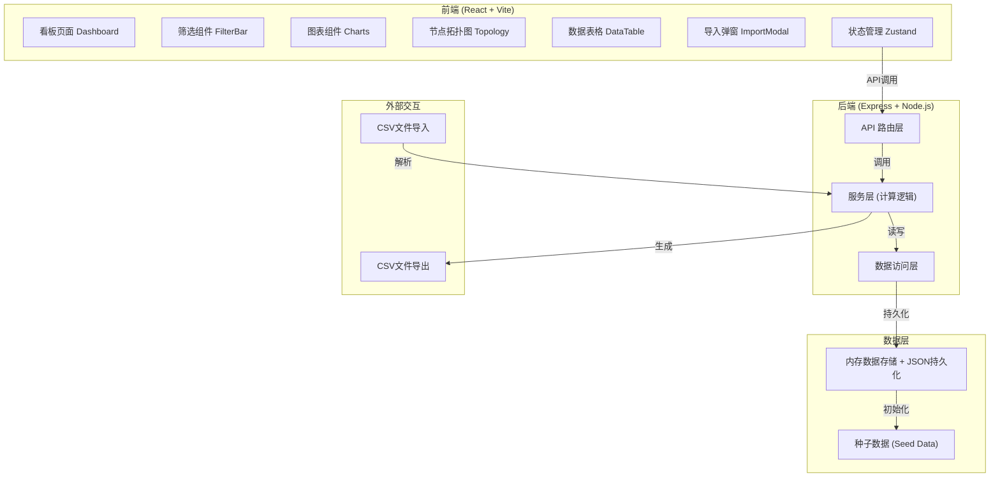
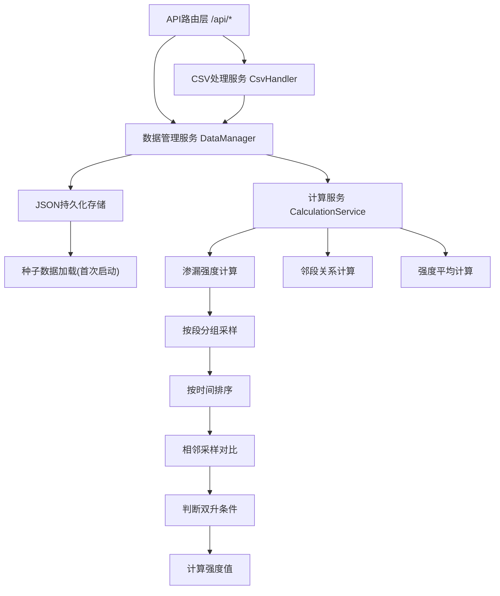

## 1. 架构设计



## 2. 技术描述

- **前端技术栈**：React@18 + TypeScript + Vite@5 + TailwindCSS@3 + Zustand@4
- **图表库**：ECharts@5（用于柱状图、散点图）
- **UI组件**：lucide-react（图标）
- **后端技术栈**：Express@4 + TypeScript + Node.js@20
- **数据存储**：内存存储 + JSON文件持久化（轻量级，无需额外数据库）
- **项目初始化工具**：vite-init
- **容器化**：Docker + Docker Compose 一键部署

## 3. 目录结构

```
project/
├── src/                          # 前端源码
│   ├── components/
│   │   ├── FilterBar.tsx         # 筛选栏组件
│   │   ├── StatCard.tsx          # 统计卡片
│   │   ├── BarChart.tsx          # 柱状对比图
│   │   ├── ScatterChart.tsx      # 邻段散点图
│   │   ├── TopologyChart.tsx     # 节点拓扑示意图
│   │   ├── DataTable.tsx         # 数据明细表
│   │   └── ImportModal.tsx       # 导入弹窗
│   ├── pages/
│   │   └── Dashboard.tsx         # 看板主页面
│   ├── store/
│   │   └── useDashboardStore.ts  # Zustand状态管理
│   ├── utils/
│   │   ├── api.ts                # API请求封装
│   │   └── format.ts             # 格式化工具函数
│   ├── types/
│   │   └── index.ts              # TypeScript类型定义
│   ├── App.tsx
│   ├── main.tsx
│   └── index.css
├── api/                          # 后端源码
│   ├── index.ts                  # Express服务入口
│   ├── routes/
│   │   └── dashboard.ts          # 看板API路由
│   ├── services/
│   │   ├── calculation.ts        # 渗漏强度计算逻辑
│   │   ├── dataManager.ts        # 数据管理服务
│   │   └── csvHandler.ts         # CSV导入导出处理
│   └── data/
│       ├── seed/                 # 种子数据
│       │   ├── segments.json     # 管廊段数据
│       │   └── samples.json      # 渗漏采样数据
│       └── store.json            # 持久化数据文件
├── shared/
│   └── types.ts                  # 前后端共享类型定义
├── Dockerfile
├── docker-compose.yml
├── package.json
├── tsconfig.json
├── vite.config.ts
├── tailwind.config.js
└── postcss.config.js
```

## 4. API 定义

### 类型定义
```typescript
// 管廊段
interface PipeSegment {
  segmentId: string;      // 段号
  corridor: string;       // 廊道
  length: number;         // 长度(米)
  upstreamNode: string;   // 上游节点
}

// 渗漏采样
interface LeakSample {
  segmentId: string;      // 段号
  sampleTime: string;     // 采样时间(ISO日期)
  conductivity: number;   // 水导率
  flow: number;           // 流量
}

// 计算结果-段渗漏强度
interface SegmentLeakage {
  segmentId: string;
  corridor: string;
  upstreamNode: string;
  avgLeakageIntensity: number;  // 平均渗漏强度
  sampleCount: number;          // 采样次数
  adjacentSegments: string[];   // 相邻段号
  neighborAvgIntensity: number; // 邻段平均渗漏强度
}

// 筛选参数
interface FilterParams {
  corridors: string[];
  startDate: string;
  endDate: string;
}
```

### API接口

| 方法 | 路径 | 描述 | 请求 | 响应 |
|------|------|------|------|------|
| GET | `/api/segments` | 获取所有管廊段列表 | - | `PipeSegment[]` |
| GET | `/api/corridors` | 获取所有廊道列表 | - | `string[]` |
| POST | `/api/analysis` | 计算渗漏分析结果 | `{ filter: FilterParams }` | `{ segments: SegmentLeakage[], summary: Summary }` |
| GET | `/api/export` | 导出当前筛选结果 | Query: `corridors, startDate, endDate` | CSV文件流 |
| POST | `/api/import` | 导入新采样数据 | `multipart/form-data: file` | `{ success: boolean, count: number }` |

## 5. 核心服务架构



## 6. 核心计算逻辑说明

### 6.1 渗漏强度计算函数
```typescript
function calculateLeakageIntensity(
  samples: LeakSample[]
): { [segmentId: string]: number } {
  // 1. 按segmentId分组
  // 2. 每组按sampleTime升序排列
  // 3. 遍历相邻采样对：
  //    - 若 conductivity[i+1] > conductivity[i] 
  //      且 flow[i+1] > flow[i]
  //    - 则：强度 += (conductivity[i+1] - conductivity[i]) / 间隔天数
  //    - 否则：强度 += 0
  // 4. 平均强度 = 总强度 / 相邻采样对数
}
```

### 6.2 邻段关系计算
```typescript
function calculateAdjacentSegments(
  segments: PipeSegment[]
): { [segmentId: string]: string[] } {
  // 1. 按corridor分组
  // 2. 每组按upstreamNode排序确定流向
  // 3. 每段的相邻段 = [前一段, 后一段]（若存在）
}
```

## 7. Docker 配置说明

- **基础镜像**：node:20-alpine
- **多阶段构建**：前端构建阶段 + 后端运行阶段
- **端口映射**：宿主 3000 → 容器 3000
- **数据卷**：`./api/data:/app/api/data` 持久化数据
- **一键启动**：`docker-compose up -d`
