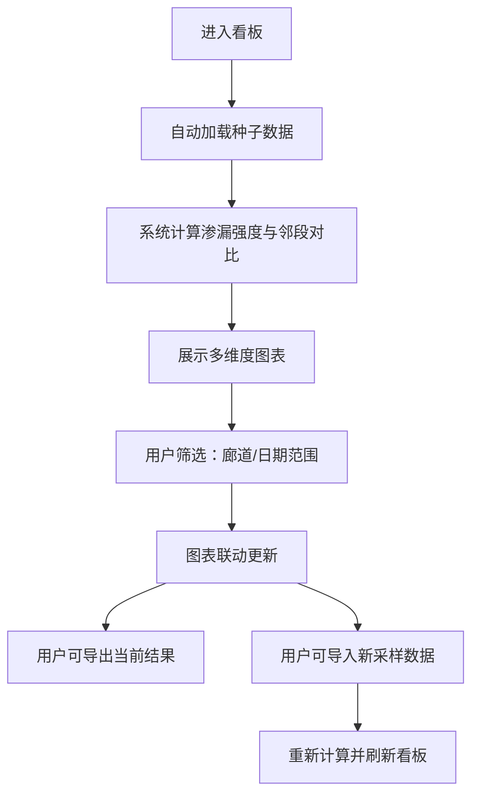

## 1. 产品概述
本系统为市政运维中心打造的地下管廊渗漏监测分析看板，实现管廊段渗漏水导率与相邻检查井负荷的可视化对比分析。通过对渗漏采样数据的智能计算，识别渗漏强度异常段，辅助运维决策。

- 核心目标：通过可视化分析快速定位高渗漏风险管廊段，对比相邻井负荷差异
- 目标用户：市政运维工程师、管廊巡检人员、运维管理人员
- 产品价值：提升管廊渗漏问题发现效率，降低运维成本，保障地下管网安全运行

## 2. 核心功能

### 2.1 功能模块
1. **数据看板主页**：综合展示管廊渗漏分析结果，支持多维度筛选与多图表联动
2. **采样数据导入**：支持追加导入新的渗漏采样数据文件
3. **数据导出**：导出当前筛选条件下的分析结果

### 2.2 页面详情

| 页面名称 | 模块名称 | 功能描述 |
|----------|----------|----------|
| 数据看板 | 顶部筛选栏 | 廊道下拉多选、日期范围选择器、重置按钮、导出按钮、导入按钮 |
| 数据看板 | 统计概览卡片 | 总段数、渗漏异常段数、平均渗漏强度、最高渗漏强度段号 |
| 数据看板 | 柱状对比图 | 各管廊段平均渗漏强度对比，支持按强度排序 |
| 数据看板 | 邻段散点图 | 本段渗漏强度与相邻两段平均强度对比散点图 |
| 数据看板 | 节点位置示意图 | 同廊道内各段上下游节点位置示意，渗漏强度热力映射 |
| 数据看板 | 数据明细表 | 展示各段详细计算结果，支持分页、排序 |
| 数据导入 | 导入弹窗 | 选择CSV文件，预览数据，确认导入 |

## 3. 核心计算逻辑与流程

### 3.1 渗漏强度计算
1. 对每段管廊，按采样时间升序排列
2. 取相邻两次采样，计算：
   - 若水导率与流量**同时上升**，则 `渗漏强度 = 水导率增量 ÷ 间隔天数`
   - 否则渗漏强度记为 0
3. 每段的平均渗漏强度 = 所有相邻采样对渗漏强度的算术平均

### 3.2 邻段对比计算
1. 在同一廊道内，按上游节点确定管廊段的相邻关系
2. 对每段取其**前后相邻两段**（若存在）的平均渗漏强度
3. 邻段平均强度 = 相邻两段渗漏强度的平均值

### 3.3 用户主流程

## 4. 用户界面设计

### 4.1 设计风格
- **主色调**：深海蓝 (#0ea5e9) 作为主色，代表水利与科技感；橙红 (#f97316) 作为警示色，标记高渗漏风险；深灰 (#0f172a) 作为深色背景基调
- **设计风格**：工业科技风，深色主题，搭配微妙的网格纹理背景，营造专业运维监控氛围
- **字体**：展示字体使用 JetBrains Mono（等宽工业感），正文字体使用 Noto Sans SC
- **卡片风格**：半透明深色卡片，细微边框，柔和的发光效果
- **图标**：使用 lucide-react 线性图标，统一 16px/18px 尺寸

### 4.2 页面设计概述

| 页面名称 | 模块名称 | UI元素描述 |
|----------|----------|------------|
| 数据看板 | 顶部标题区 | 左侧：系统标题 + 市政运维中心标识；右侧：数据更新时间、导入/导出按钮 |
| 数据看板 | 筛选栏 | 整行横向排列：廊道多选标签、开始日期、结束日期、重置按钮 |
| 数据看板 | 概览卡片行 | 4张统计卡片横向排列，悬浮动效，关键指标大号展示 |
| 数据看板 | 图表区上排 | 左侧：柱状图（60%宽度）；右侧：散点图（40%宽度） |
| 数据看板 | 图表区下排 | 左侧：节点位置示意图（50%宽度）；右侧：数据明细表（50%宽度） |
| 数据看板 | 节点示意图 | SVG绘制管廊段线性拓扑图，按渗漏强度渐变着色 |

### 4.3 交互动效
- 页面加载：图表依次淡入（stagger 100ms）
- 卡片悬浮：轻微上浮 + 边框发光
- 图表交互：柱状图点击高亮、散点图tooltip详情、节点图hover显示段信息
- 筛选切换：数据平滑过渡动画

### 4.4 响应式
- 桌面端（默认）：按上述布局展示
- 平板端：图表区改为单列堆叠
- 移动端：筛选栏折叠为抽屉，图表垂直排列
